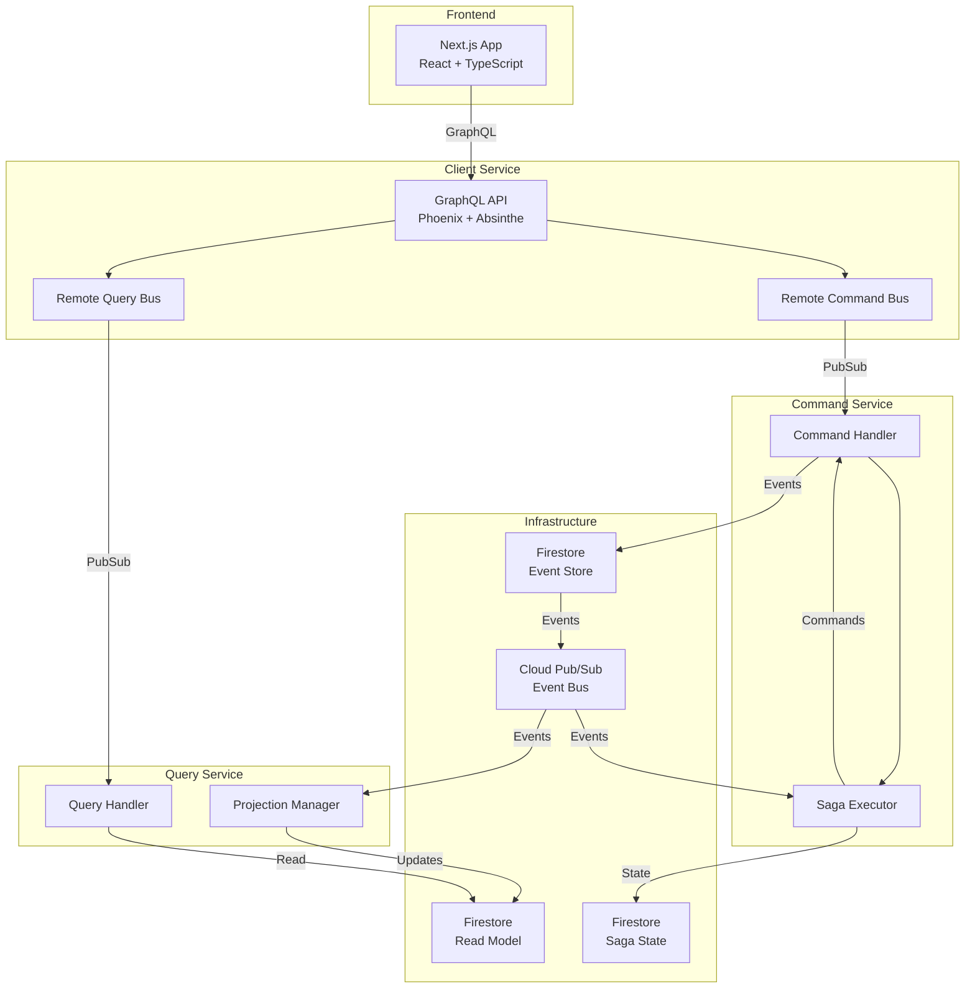

# アーキテクチャ

## 概要

Event Driven Playground は、CQRS (Command Query Responsibility Segregation) と Event Sourcing パターンを実装したマイクロサービスアーキテクチャです。

## システム構成



## 主要コンポーネント

### 1. Client Service (GraphQL API)

- **役割**: フロントエンドとバックエンドサービス間のゲートウェイ
- **技術**: Phoenix Framework + Absinthe
- **機能**:
  - GraphQL スキーマの定義と実行
  - 認証・認可（Firebase Authentication）
  - コマンドとクエリのルーティング
- **通信**:
  - RemoteCommandBus: PubSub 経由で Command Service と通信
  - RemoteQueryBus: PubSub 経由で Query Service と通信

### 2. Command Service

- **役割**: コマンド（書き込み操作）の処理
- **責務**:
  - ビジネスロジックの実行
  - イベントの生成と永続化
  - ドメインの整合性保証
- **パターン**: アグリゲートパターンを使用
- **コンポーネント**:
  - CommandHandler: コマンドの実行
  - SagaExecutor: 分散トランザクションの管理
  - UnitOfWork: トランザクション境界の管理

### 3. Query Service

- **役割**: クエリ（読み取り操作）の処理
- **責務**:
  - Read Model の構築と管理
  - 最適化されたクエリの実行
  - イベントからの投影（Projection）
- **コンポーネント**:
  - QueryHandler: クエリの実行
  - ProjectionManager: イベントから Read Model への投影
  - Cache: クエリ結果のキャッシング

### 4. Saga Executor

- **役割**: 分散トランザクションの管理
- **機能**:
  - 複数のサービスにまたがるビジネスプロセスの調整
  - 補償トランザクション（Compensating Transaction）の実行
  - タイムアウトとリトライの管理
- **実装**:
  - GenServer による Saga ライフサイクル管理
  - GenStateMachine による状態遷移管理
  - Firestore での Saga 状態の永続化
- **実装例**:
  - 注文処理 Saga（在庫確保 → 決済処理 → 配送手配）

### 5. Remote Bus 層

- **Remote Command Bus**:
  - Client Service から Command Service への非同期コマンド送信
  - Cloud Pub/Sub を使用した疎結合通信
  - リクエスト/レスポンスパターンの実装
  - サーキットブレーカーによる障害対策

- **Remote Query Bus**:
  - Client Service から Query Service への非同期クエリ送信
  - 同様に Pub/Sub を使用
  - タイムアウト管理とエラーハンドリング

### 6. Projection Manager

- **役割**: イベントから Read Model への投影管理
- **機能**:
  - リアルタイムイベント処理
  - プロジェクションの再構築
  - バッチ処理による効率的な更新
  - Dead Letter Queue によるエラー処理

## CQRS と Event Sourcing

### CQRS の実装

```elixir
# コマンド側（Command Service）
defmodule CommandService.Products.CreateProduct do
  def execute(params) do
    # ビジネスロジックの実行
    # イベントの生成
    # Event Store への保存
  end
end

# クエリ側（Query Service）  
defmodule QueryService.Products.GetProduct do
  def execute(product_id) do
    # Read Model から最適化されたデータを取得
  end
end
```

### Event Sourcing の実装

すべての状態変更はイベントとして記録されます：

```elixir
# イベントの例
%ProductCreated{
  aggregate_id: "product-123",
  name: "商品名",
  price: 1000,
  category_id: "category-456",
  timestamp: ~U[2024-01-01 00:00:00Z]
}
```

## データフロー

### 1. コマンドフロー（書き込み）

1. フロントエンドが GraphQL Mutation を送信
2. Client Service がコマンドを Command Service にルーティング
3. Command Service がビジネスロジックを実行
4. イベントを生成し、Event Store（Firestore）に保存
5. イベントを Pub/Sub に発行
6. 成功/失敗をフロントエンドに返す

### 2. クエリフロー（読み取り）

1. フロントエンドが GraphQL Query を送信
2. Client Service がクエリを Query Service にルーティング
3. Query Service が Read Model から最適化されたデータを取得
4. 結果をフロントエンドに返す

### 3. イベント処理フロー

1. Command Service がイベントを Pub/Sub に発行
2. Query Service がイベントをサブスクライブ
3. イベントハンドラーが Read Model を更新
4. 最新の状態がクエリで利用可能になる

## Firestore の使用

### コレクション構造

```
firestore/
├── events/                    # Event Store
│   └── {aggregate_id}/
│       └── {event_id}        # 個別のイベント
├── command_service/           # Command側の状態
│   ├── categories/
│   ├── products/
│   ├── orders/
│   └── sagas/               # Saga の状態
└── query_service/            # Read Model
    ├── categories/
    ├── products/
    └── orders/
```

### Event Store の設計

- 各アグリゲートのイベントは独立したコレクションに保存
- イベントは append-only（追加のみ）
- イベントの順序は timestamp で管理

## スケーラビリティ

### 水平スケーリング

- 各サービスは独立してスケール可能
- Cloud Run の自動スケーリング機能を活用
- Read Model の複製による読み取り性能の向上

### 非同期処理

- Pub/Sub による疎結合
- イベント駆動による最終的整合性
- バックプレッシャー制御

## セキュリティ

### 認証・認可

- Firebase Authentication による認証
- JWT トークンの検証
- ロールベースのアクセス制御（RBAC）

### データ保護

- HTTPS による通信の暗号化
- Firestore のセキュリティルール
- Secret Manager による機密情報管理

## 監視とロギング

### メトリクス

- Cloud Monitoring によるシステムメトリクス
- カスタムメトリクス（処理時間、エラー率など）
- アラート設定

### トレーシング

- OpenTelemetry による分散トレーシング
- リクエストの追跡とボトルネックの特定

### ロギング

- 構造化ログ（JSON形式）
- Cloud Logging への集約
- エラーログの自動アラート

## デプロイメント

### CI/CD パイプライン

- GitHub Actions による自動デプロイ
- Cloud Build での Docker イメージビルド
- Cloud Run への段階的デプロイ
- ヘルスチェックによる検証

### インフラストラクチャ

- **Cloud Run**: サーバーレスコンテナ実行環境
- **Firestore**: マネージド NoSQL データベース
- **Cloud Pub/Sub**: メッセージングサービス
- **Artifact Registry**: Docker イメージレジストリ
- **Cloud Load Balancing**: 負荷分散とルーティング